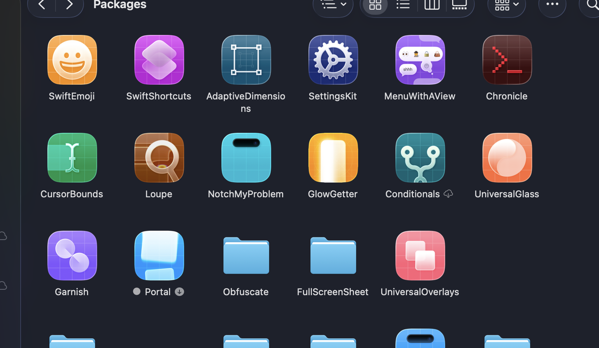

# auto-folder-icon

A macOS CLI tool to set folder icons from embedded project assets.

I use this to brand all my Swift package folders so I can quickly identify them in Finder.



## Installation

### From Source

```bash
git clone https://github.com/aethertap/auto-folder-icon.git
cd auto-folder-icon
swift build -c release
cp .build/release/foldericon /usr/local/bin/
```

### Homebrew (coming soon)

```bash
brew install auto-folder-icon
```

## Usage

```bash
# Set icon for a single folder
foldericon ~/Projects/MyApp

# Set icons for multiple folders
foldericon ~/Projects/Pkg1 ~/Projects/Pkg2 ~/Projects/Pkg3

# Set icons for all subdirectories in a folder
foldericon --all ~/Projects/Packages

# Use a custom icon file
foldericon --icon ~/icons/custom.png ~/Projects/MyApp

# Remove a folder's custom icon
foldericon --remove ~/Projects/MyApp
```

## How It Works

auto-folder-icon searches for `icon.png` in common locations within your project:

1. `assets/icon.png`
2. `resources/icon.png`
3. `resources/icon/icon.png`
4. `resources/icons/icon.png`
5. `Resources/icon.png`
6. `Resources/icon/icon.png`
7. `icon.png`

If not found in these locations, it searches recursively (skipping `.build`, `node_modules`, and `checkouts` directories).

## Options

| Option | Description |
|--------|-------------|
| `--all` | Process all subdirectories in the given folder |
| `--icon <path>` | Use a custom icon file instead of auto-detecting |
| `--remove` | Remove the folder's custom icon |
| `--skip-gitignore` | Don't add `Icon?` to `.gitignore` |
| `--help` | Show help information |

## .gitignore

By default, auto-folder-icon adds `Icon?` to each folder's `.gitignore` to prevent the macOS icon resource file from being tracked by git. Use `--skip-gitignore` to disable this behavior.

## Requirements

- macOS 12.0+
- Swift 5.9+

## License

MIT
